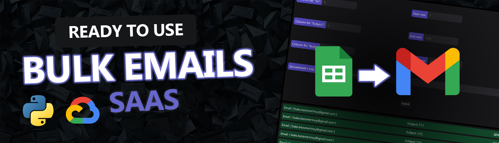

> I am not responsible for your actions. By downloading software from this repository, you agree to follow the law. Use it for your own risk. I don't want to be another Oppenheimer and made this tool with good intentions

   
    
   
  
<h1> Google Sheets Email Sender with OAuth2 Authentication</h1>
  <b>Send Emails in Seconds</b> using Google Sheets and a User-Friendly Website 

## 📋 <a name="table">Table of Contents</a>

1. 🤖 [Introduction](#introduction)
2. 🔋 [Features](#features)
3. 🤸 [Quick Start](#quick-start)

## <a name="introduction">🤖 Introduction</a>

This project is a Flask-based web application designed to streamline the process of sending emails using data from a Google Sheet. With the power of Google OAuth2 authentication, users can securely sign in with their Google accounts, access specific Google Sheets, and send personalized emails to recipients listed in the sheet.

## <a name="features">🔋 Features</a>

👉**User Authentication with Google OAuth2**

- Users can sign in with their Google accounts.
- The application requests access to:
  - Google Drive metadata
  - Google Spreadsheets
  - Gmail (to send emails)
  - User email and profile information (to display data in email)

👉**Email Sending from Google Sheet Data**

- Users can specify the columns and ranges from a Google Sheet to fetch recipient emails, email subjects, and email bodies.
- Emails are sent to the specified recipients using the Gmail API.
- The application handles potential errors, such as invalid email addresses and reaching the Gmail API daily limit.

👉**Environment Variables:**

- **ALLOWED_ORIGINS**: List of allowed CORS origins.
- **FLASK_SECRET_KEY**: Secret key for Flask session.
- **MONGO_URI**: MongoDB connection string.
- **CLIENT_ID**: Google OAuth2 client ID.
- **PROJECT_ID**: Google OAuth2 project ID.
- **CLIENT_SECRET**: Google OAuth2 client secret.
- **REDIRECT_URIS**: List of allowed redirect URIs for OAuth2.
- **JAVASCRIPT_ORIGINS**: List of JavaScript origins for OAuth2.

👉**Endpoints:**

- **/**: Home route to serve sign-in page and account details.
- **/authorize**: Initiates the OAuth2 authorization flow.
- **/oauth2callback**: Callback URL for OAuth2 authorization.
- **/account**: Account management route to fetch and display user data and send emails.
- **/clear**: Route to clear user session and logout.

👉**Functions:**

- **serve()**: Handles GET and POST requests for the home route. It checks the user's session and redirects to the account page after successful authentication.
- **authorize()**: Initiates the OAuth2 authorization flow and redirects the user to Google's authorization page.
- **oauth2callback()**: Handles the OAuth2 callback, fetches user credentials, and redirects to the home route.
- **account()**: Handles GET and POST requests for the account route. It fetches the specified Google Sheet data and sends emails.
- **clear()**: Clears the user's session and redirects to the home page.
- **send_email()**: Sends emails using the Gmail API based on the fetched Google Sheet data.
- **credentials_to_dict()**: Converts OAuth2 credentials to a dictionary format.

## <a name="quick-start">🤸 Quick Start</a>

1. Clone the repository.
2. Install the required dependencies using `pip install -r requirements.txt`.
3. Set up the required environment variables in a `.env` file.
4. Make enviroment: `py -3 -m venv .venv `.
5. Activate flask enviroment `.venv\Scripts\activate`.
6. Install all required dependencies.
7. Run the application using `flask run`.
